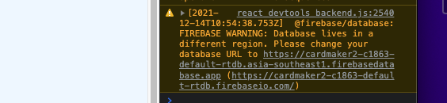
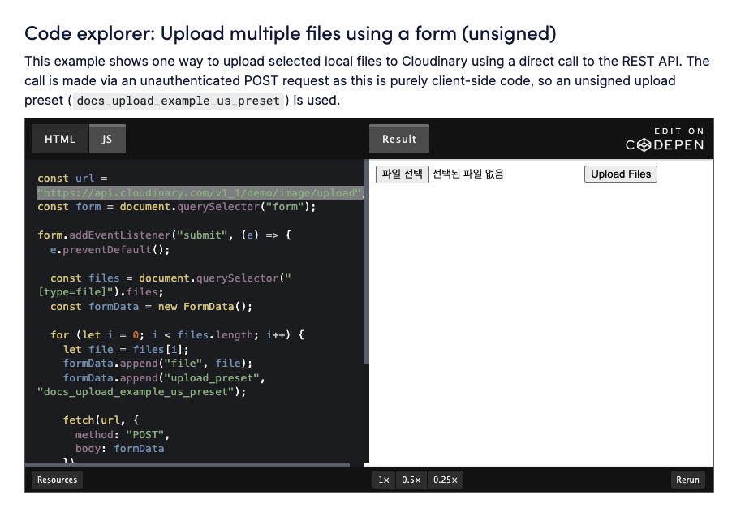

## ✏️Business Card Maker

    React 와 Firebase 로 만드는 Business Card Maker

## 🎯 실행화면

## 🛠 Tech Stack

<p>
    
    
    
</p>

## 🎯 프로젝트 요구사항

    - [X] 로그인페이지
        - [X] 구글연동버튼 ✏️파이베이스 인증을 통해 구현✏️
        - [X] 깃헙연동버튼 ✏️파이베이스 인증을 통해 구현✏️
    - [X] 헤더구현.
        -[X] 로그인상태일때 헤더에 로그아웃 버튼 시각화.
            - [X] 로그아웃 기능 구현. 클릭시 자동으로 로그인화면으로 이동.
    - [X] 풋터구현.
    - [X] edit card page 구현.
        - [X] edit card component 구현.
            - [X] 카드 추가하면 (Add 버튼이 Delete 버튼으로 변환.)새로운 edit card 생성.
            - [X] 삭제기능 추가.
        - [X] card preview component 구현.
            - [X] color 바꿈 구현.
            - [X] 실시간 업데이트 구현.
    - [ ] 반응형 웹 구현.
    - [X] 이미지 업로드.

## ❓공부하면서 배운점

- ## css
  `textarea` 태그 기본 옵션이 display:inline 이기때문에 밑에 빈공간이 생긴다 => display:block 으로 바꾸면 해결할 수 있다.
- ## firebase

  `error`:
  
  실시간 데이터베이스 url이 안맞아서 데이터가 못 올라가는 상태이다 데이터베이스 url을 바꾸는 방법을 몰라서 한참 헤멧다.

  `해결방법`: firebase 콘솔로 이동해서 기본 GCP 리소스 위치 를 리얼데이터베이스 위치랑 같은 위치로 설정해두고 새로 엄데이트 된 firebaseConfig 를 업데이트 해 줬다.

- ## cloudniary 를 통한 unsigned 방식 이미지 업로드.

    <Link>https://cloudinary.com/documentation/upload_images<Link>
    
    코드를 참조해서 했다.
    여기서

  ```javascript
  const url = 'https://api.cloudinary.com/v1_1/demo/image/upload';
  ```

  demo=
  
  upload_preset = setting->upload preset 의 unsigned 부분이다.
